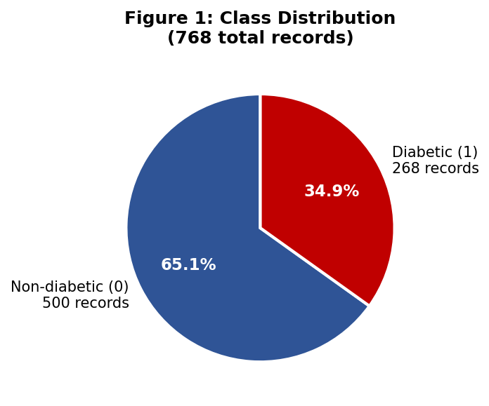
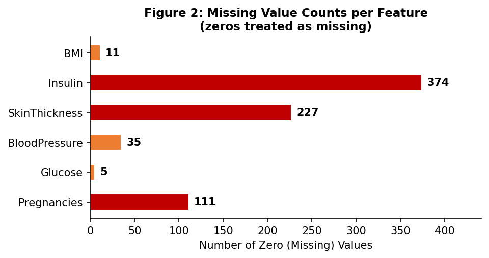
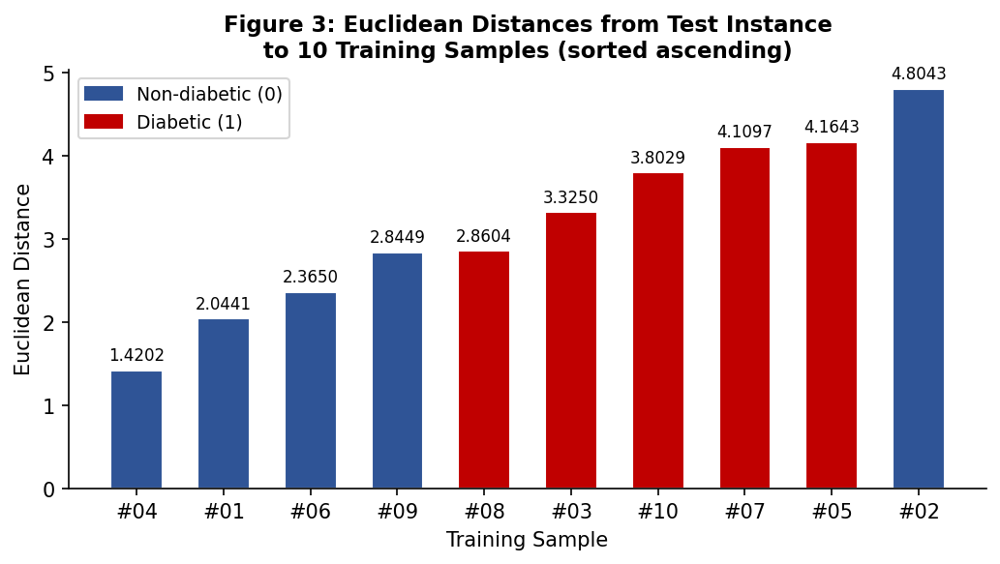
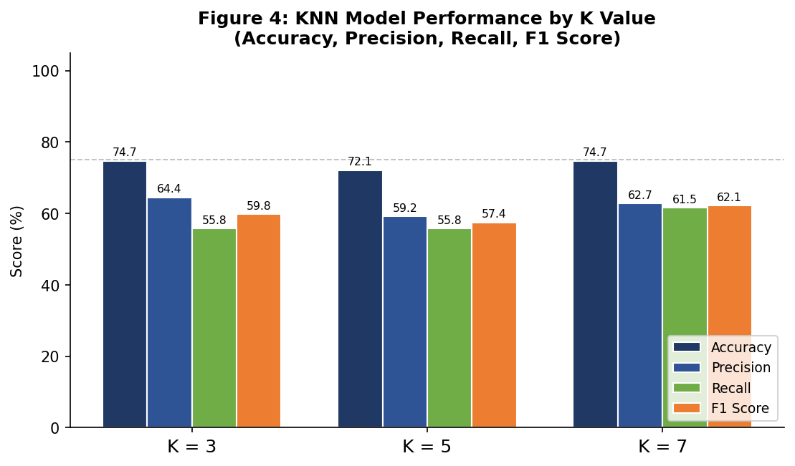
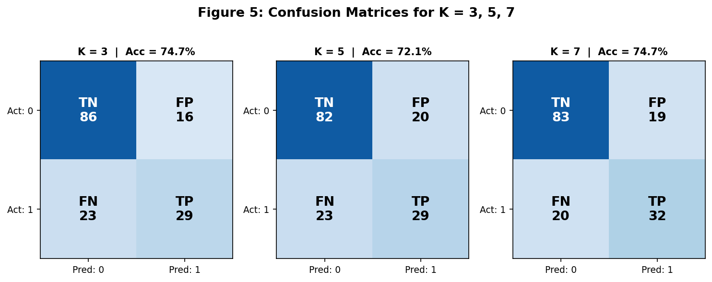
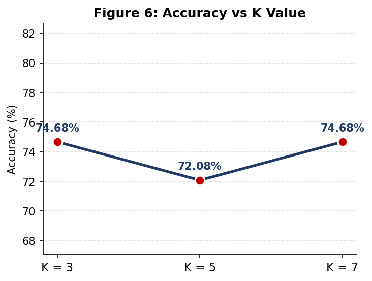

# 🧠 K-Nearest Neighbors & K-Means Clustering

> **Finals Activity 2: Computational Science (CsElec01A)**  
> KNN and K-Means algorithms implemented in Python to demonstrate foundational understanding of machine learning mechanics.

**Group 14**

---

## 📋 Table of Contents

- [Overview](#overview)
- [Project Structure](#project-structure)
- [Part 1 — K-Nearest Neighbors (KNN)](#part-1--k-nearest-neighbors-knn)
  - [The Dataset & The New Entry](#the-dataset--the-new-entry)
  - [Step 1: Compute Euclidean Distance](#step-1-compute-euclidean-distance)
  - [Step 2: Sort by Distance](#step-2-sort-by-distance-ascending)
  - [Step 3: Choose K & Vote](#step-3-choose-k--vote-among-nearest-neighbors)
  - [Step 4: Update the Dataset](#step-4-update-the-dataset)
  - [KNN Visualization](#knn-visualization)
- [Part 2 — K-Means Clustering](#part-2--k-means-clustering)
  - [Step 1: Transform to Table](#step-1-transform-the-dataset-into-a-working-table)
  - [Step 2: Initialize Centroids](#step-2-initialize-k-centroids)
  - [Step 3: Compute Distance & Assign Clusters](#step-3-compute-distance--assign-clusters)
  - [Step 4: Recompute Centroids](#step-4-recompute-centroids)
  - [Iteration & Convergence](#iteration--convergence)
  - [Final Clusters](#final-clusters--k-means-in-action)
- [Extended Activity — Diabetes KNN Analysis](#extended-activity--diabetes-knn-analysis)
  - [Dataset Overview](#dataset-overview)
  - [Data Preprocessing](#data-preprocessing)
  - [KNN Classification](#knn-classification)
  - [Model Evaluation](#model-evaluation)
  - [Analysis & Reflection](#analysis--reflection)
- [Extended Activity — Automobile Dataset](#extended-activity--automobile-dataset)
- [Bias Analysis](#bias-analysis)
- [Technologies Used](#technologies-used)
- [Authors](#authors)

---

## Overview

This project implements two fundamental machine learning algorithms to demonstrate a deep understanding of how they work internally. Both algorithms share the same core distance metric but serve fundamentally different purposes:

| | K-Nearest Neighbors | K-Means Clustering |
|---|---|---|
| **Type** | Supervised Classification | Unsupervised Clustering |
| **Goal** | Classify a new point by majority vote of its neighbors | Group points into K segments by proximity to centroids |
| **Training** | None — memorizes the entire dataset (lazy learner) | Iterative — adjusts centroids until convergence |
| **Core Formula** | $d = \sqrt{(X_2 - X_1)^2 + (Y_2 - Y_1)^2}$ | Same Euclidean distance + centroid mean |
| **Output** | A class label for the new point | K cluster assignments for all points |

> **Same Euclidean distance under the hood — but very different goals.**

---

## Project Structure

```
├── README.md
├── knn.py                        # KNN implementation (Customer Tier classification)
├── knn_dataset.csv               # Custom customer dataset (24 entries, 3 tiers)
├── knn_visualization.png         # KNN scatter plot with decision boundary
├── kmeans.py                     # K-Means implementation (Customer Segmentation)
├── kmeans_dataset.csv            # Custom customer dataset (30 entries)
├── kmeans_steps_output.csv       # Full iteration-by-iteration computation log
├── kmeans_visualization.png      # Final cluster visualization
├── Group14_KNN_KMeans.pptx       # Presentation walkthrough
│
└── knn_activity/                 # Extended activities & real-world applications
    ├── knn_model.py              # KNN on Pima Diabetes dataset
    ├── diabetes-k-nn.csv         # Pima Indians Diabetes dataset (768 samples)
    ├── kNN_guidelines.md         # Activity guidelines
    ├── knn-activity.pdf          # Activity instructions/rubric
    ├── Homework_Report.docx      # Written report for diabetes KNN analysis
    ├── Homework_Report.pdf       # PDF version of the report
    ├── chart_01_class_distribution.png   # Class distribution pie chart
    ├── chart_02_missing_values.png       # Missing value counts
    ├── chart_03_euclidean_distances.png  # Distance bar chart
    ├── chart_04_model_performance.png    # Accuracy/Precision/Recall/F1
    ├── chart_05_confusion_matrices.png   # Confusion matrices for K=3,5,7
    ├── chart_06_accuracy_vs_k.png        # Accuracy vs K curve
    ├── autos_ml_algorithms.py    # KNN + K-Means on Automobile dataset
    ├── autos-k-means.csv         # Automobile dataset (horsepower, mpg, price)
    ├── Autos_KNN_KMeans_Presentation.pptx  # Autos dataset presentation
    ├── Autos_KNN_KMeans_StepByStep.pptx    # Autos walkthrough
    └── visuals_autos/            # Generated visualizations for automobile dataset
```

---

## Part 1 — K-Nearest Neighbors (KNN)

> *Classify a new customer by looking at the K most similar customers we already know.*

**File:** [`knn.py`](knn.py)

### The Dataset & The New Entry

Our custom dataset contains **24 customers** with two features and a class label:

| Feature | Description | Range |
|---------|-------------|-------|
| `Annual_Income_k` | Annual income in thousands (\$) | 22–120 |
| `Store_Visits_Per_Month` | Monthly store visit frequency | 1–15 |
| `Customer_Tier` | Class label | Basic / Silver / Gold |

**Distribution:** 8 Basic, 8 Silver, 8 Gold (balanced — intentionally designed to prevent majority-class bias in KNN voting).

**The new customer to classify:**

| Annual Income | Store Visits / Month | Tier |
|:---:|:---:|:---:|
| \$65k | 5 | **?** |

**Goal:** Predict the customer tier using the K nearest neighbors.

---

### Step 1: Compute Euclidean Distance

For every existing customer, we compute the Euclidean distance to the new entry using the formula:

$$d = \sqrt{(X_2 - X_1)^2 + (Y_2 - Y_1)^2}$$

Where:
- $X$ = Annual Income ($k)
- $Y$ = Store Visits per month

**Worked example — New Entry vs Customer #10** ($\text{Income} = 65, \text{Visits} = 6$):

$$d_{10} = \sqrt{(65 - 65)^2 + (5 - 6)^2} = \sqrt{0 + 1} = 1.00$$

The new point $(65, 5)$ is just **1.00 unit** from Customer #10. This computation is repeated programmatically for all 24 customers:

```python
# Distance formula: sqrt((X2 - X1)^2 + (Y2 - Y1)^2)
distance = math.sqrt((x2 - x1)**2 + (y2 - y1)**2)
```

Each step is printed to the console showing the full substitution:

```
d1 (ID 1) = sqrt((65 - 25)^2 + (5 - 2)^2)
   = 40.11
d2 (ID 2) = sqrt((65 - 30)^2 + (5 - 3)^2)
   = 35.06
...
```

---

### Step 2: Sort by Distance (Ascending)

After computing all distances, we **sort the dataset in ascending order** — smallest distance = most similar customer. The top of the sorted list contains our candidates for voting.

| Rank | Customer ID | Income (\$k) | Visits | Tier | Distance |
|:---:|:---:|:---:|:---:|:---:|:---:|
| 1 | 10 | 65 | 6 | Silver | 1.00 |
| 2 | 16 | 64 | 7 | Silver | 2.24 |
| 3 | 15 | 68 | 5 | Silver | 3.00 |
| ... | ... | ... | ... | ... | ... |

The highlighted rows (top 3) are the candidates for our majority vote.

---

### Step 3: Choose K & Vote Among Nearest Neighbors

We choose $K = 3$ nearest neighbors:

| Rank | Customer | Distance | Tier |
|:---:|:---:|:---:|:---:|
| #1 | Customer 10 | 1.00 | **Silver** |
| #2 | Customer 16 | 2.24 | **Silver** |
| #3 | Customer 15 | 3.00 | **Silver** |

**Vote Tally:**

| Tier | Votes |
|:---:|:---:|
| Silver | 3 ✅ |
| Basic | 0 |
| Gold | 0 |

$$\text{Predicted Tier} = \arg\max(\text{votes}) = \textbf{Silver}$$

The majority among the 3 nearest neighbors is **Silver** — unanimous in this case.

---

### Step 4: Update the Dataset

After classification, the new customer is inserted into the dataset:

- **Before:** 24 customers
- **After:** 25 customers (new Customer #25 added with tier = Silver)

> *The dataset grows. Next time we classify, this customer also gets a vote.*

---

### KNN Visualization

The scatter plot shows all customers color-coded by tier, with:
- ⭐ **Red star** — the new point $(65, 5)$
- **Dashed lines** — connections to the $K=3$ nearest neighbors
- **Dashed circle** — the $K=3$ decision boundary (radius = distance to the 3rd nearest neighbor)


---

## Part 2 — K-Means Clustering

> *Group customers into K segments by repeatedly assigning points to the nearest centroid and recomputing the centroid.*

**File:** [`kmeans.py`](kmeans.py)

### Step 1: Transform the Dataset into a Working Table

Our dataset has **30 customers** with two features:

| Feature | Description | Range |
|---------|-------------|-------|
| `Annual_Income_k` | Annual income in thousands (\$) | 15–110 |
| `Spending_Score` | Spending behavior score | 3–95 |

Each customer is mapped to a 2D coordinate: $P_i = (X_i, Y_i)$ where $X$ = Income and $Y$ = Spending.

---

### Step 2: Initialize K Centroids

We choose $K = 5$ starting centers, **randomly selected** from the dataset using `random.seed(42)` for reproducibility:

| Centroid | $X$ (Income) | $Y$ (Spending) |
|:---:|:---:|:---:|
| $C_1$ | 70.0 | 10.0 |
| $C_2$ | 16.0 | 77.0 |
| $C_3$ | 15.0 | 39.0 |
| $C_4$ | 78.0 | 85.0 |
| $C_5$ | 19.0 | 3.0 |

> **Why random initialization?** Hardcoded centroids introduce **initialization bias** — the final clusters could be predetermined by the analyst's choice. Random selection with a fixed seed ensures reproducibility while removing subjective bias.

---

### Step 3: Compute Distance & Assign Clusters

For every point $P_i$, we measure the Euclidean distance to every centroid $C_j$:

$$d(P_i, C_j) = \sqrt{(X_{P_i} - X_{C_j})^2 + (Y_{P_i} - Y_{C_j})^2}$$

The **smallest distance wins** — that point joins that cluster:

$$\text{cluster}(P_i) = \arg\min_j \; d(P_i, C_j)$$

**Example — Point $P_1$ (15.0, 39.0) in Iteration 1:**

| | $C_1$ (70, 10) | $C_2$ (16, 77) | $C_3$ (15, 39) | $C_4$ (78, 85) | $C_5$ (19, 3) |
|:---:|:---:|:---:|:---:|:---:|:---:|
| $d(P_1, C_j)$ | 62.18 | 38.01 | **0.00** | 78.01 | 36.22 |

$\min = 0.00$ → $P_1$ is assigned to **Cluster 3** (which makes sense — it's the centroid itself).

---

### Step 4: Recompute Centroids

After all 30 points are assigned, each centroid is recalculated as the **mean** of all points in its cluster:

$$C_j^{\text{new}} = \left( \frac{1}{|S_j|} \sum_{P_i \in S_j} X_i, \;\; \frac{1}{|S_j|} \sum_{P_i \in S_j} Y_i \right)$$

Where $S_j$ is the set of points assigned to cluster $j$, and $|S_j|$ is its size.

**After Iteration 1 — New Centroids:**

| Centroid | New $X$ | New $Y$ |
|:---:|:---:|:---:|
| $C_1$ | 78.83 | 20.50 |
| $C_2$ | 17.00 | 80.00 |
| $C_3$ | 36.71 | 47.00 |
| $C_4$ | 76.67 | 73.22 |
| $C_5$ | 17.67 | 5.00 |

> ↻ **Loop:** Now go back to Step 2 with these new centroids and repeat. We stop when **no point changes cluster**.

---

### Iteration & Convergence

The algorithm iterates, recomputing centroids each round until convergence:

| Iteration | $C_1$ | $C_2$ | $C_3$ | $C_4$ | $C_5$ | Points Changed? |
|:---:|:---:|:---:|:---:|:---:|:---:|:---:|
| 1 | (78.83, 20.50) | (17.00, 80.00) | (36.71, 47.00) | (76.67, 73.22) | (17.67, 5.00) | ✅ Yes |
| 2 | (82.60, 15.60) | (17.00, 80.00) | (43.40, 48.00) | (81.86, 79.00) | (17.67, 5.00) | ✅ Yes |
| 3 | (82.60, 15.60) | (17.00, 80.00) | (47.25, 48.75) | (88.00, 89.60) | (17.67, 5.00) | ✅ Yes |
| **4** | (82.60, 15.60) | (17.00, 80.00) | (47.25, 48.75) | (88.00, 89.60) | (17.67, 5.00) | **❌ No → Converged!** |

> ✓ **Converged at Iteration 4** — No point switched clusters between iterations 3 and 4. The algorithm stops.

---

### Final Clusters — K-Means in Action

The algorithm discovered **5 customer segments**:

| Cluster | Profile | Centroid |
|:---:|:---|:---:|
| 🟢 **Cluster 1** | High income · Low spending | (82.60, 15.60) |
| 🟠 **Cluster 2** | Low income · High spending | (17.00, 80.00) |
| 🟣 **Cluster 3** | Middle income · Middle spending | (47.25, 48.75) |
| 🔵 **Cluster 4** | High income · High spending | (88.00, 89.60) |
| 🔴 **Cluster 5** | Low income · Low spending | (17.67, 5.00) |


---

## Extended Activity — Diabetes KNN Analysis

**Files:** [`knn_activity/knn_model.py`](knn_activity/knn_model.py) · [`Homework_Report.pdf`](knn_activity/Homework_Report.pdf)  
**Dataset:** Pima Indians Diabetes Dataset — **768 records**, 8 features, binary outcome (Diabetic / Non-diabetic)

### Dataset Overview

The dataset contains 768 patient records with 8 physiological features and a binary outcome:

| Feature | Description |
|---|---|
| Pregnancies | Number of prior pregnancies |
| Glucose | Plasma glucose concentration (2h oral glucose tolerance test) |
| BloodPressure | Diastolic blood pressure (mm Hg) |
| SkinThickness | Triceps skinfold thickness (mm) |
| Insulin | 2-hour serum insulin (μU/mL) |
| BMI | Body mass index ($\text{weight (kg)} / \text{height (m)}^2$) |
| DiabetesPedigreeFunction | Diabetes hereditary risk score |
| Age | Patient age (years) |

**Class distribution:** 500 Non-diabetic (65.1%) vs 268 Diabetic (34.9%) — imbalanced toward the majority class.



### Data Preprocessing

#### Missing / Zero Value Detection

Several features contain physiologically impossible zeros (e.g., Glucose = 0, BMI = 0) which represent missing data:

| Feature | Zero Count | Percentage | Action |
|---------|:---:|:---:|:---|
| Glucose | 5 | 0.65% | Median imputation |
| BloodPressure | 35 | 4.56% | Median imputation |
| SkinThickness | 227 | 29.56% | Median imputation |
| Insulin | 374 | 48.70% | Median imputation |
| BMI | 11 | 1.43% | Median imputation |

**Why median imputation?** Several features (especially Insulin) are heavily right-skewed. The median is robust to outliers and preserves the central tendency better than the mean. Row removal was rejected because it would eliminate ~50% of the dataset.



#### Feature Scaling: Z-Score Standardisation

KNN relies on Euclidean distance, making it **extremely sensitive to feature scale**. Without scaling, Insulin (range 0–846) would completely dominate BMI (range 0–67.1), producing meaningless distances.

**Z-score standardisation** transforms each feature to have $\mu = 0$ and $\sigma = 1$:

$$z = \frac{x - \mu}{\sigma}$$

Where $\mu$ is the feature mean and $\sigma$ is the population standard deviation. This ensures all features contribute equally to the distance computation.

---

### KNN Classification

#### Train-Test Split

The dataset (768 samples) was split **80/20** with a fixed random seed (42) for reproducibility:
- **Training set:** 614 samples (80.0%)
- **Test set:** 154 samples (20.0%)

#### Distance Computation

One test instance (true label = Non-diabetic) was selected. Euclidean distances were computed against 10 training samples for illustration, using the formula:

$$d(\mathbf{p}, \mathbf{q}) = \sqrt{\sum_{i=1}^{8} (p_i - q_i)^2}$$

**Worked Example — Training Sample #01 (Non-diabetic):**

| Feature | Test (z) | Train (z) | Diff | Diff² |
|---|:---:|:---:|:---:|:---:|
| Pregnancies | −0.84489 | −0.54792 | −0.29697 | 0.08819 |
| Glucose | −1.07357 | −1.27082 | 0.19725 | 0.03891 |
| BloodPressure | −0.52832 | −0.61104 | 0.08272 | 0.00684 |
| SkinThickness | −0.69525 | −0.12613 | −0.56912 | 0.32390 |
| Insulin | −0.54064 | −0.86499 | 0.32435 | 0.10520 |
| BMI | −0.63388 | 0.63237 | −1.26625 | 1.60338 |
| DiabetesPedigreeFunction | −0.92076 | 0.47453 | −1.39529 | 1.94685 |
| Age | −1.04155 | −0.78629 | −0.25526 | 0.06516 |
| **Sum of Squared Differences** | | | | **4.17843** |

$$d = \sqrt{4.17843} = 2.04412$$

#### Sorted Distances & Neighbour Identification

| Rank | Sample # | Distance | Label |
|:---:|:---:|:---:|:---|
| 1 | #04 | 1.42024 | Non-diabetic (0) |
| 2 | #01 | 2.04412 | Non-diabetic (0) |
| 3 | #06 | 2.36497 | Non-diabetic (0) |
| 4 | #09 | 2.84493 | Non-diabetic (0) |
| 5 | #08 | 2.86041 | Diabetic (1) |
| 6 | #03 | 3.32505 | Diabetic (1) |
| 7 | #10 | 3.80292 | Diabetic (1) |
| 8 | #07 | 4.10975 | Diabetic (1) |
| 9 | #05 | 4.16433 | Diabetic (1) |
| 10 | #02 | 4.80429 | Non-diabetic (0) |

**Predictions from these 10 samples:**
- **K=3:** Neighbours = [0, 0, 0] → **Non-diabetic** (unanimous)
- **K=5:** Neighbours = [0, 0, 0, 0, 1] → **Non-diabetic** (4 vs 1)
- **K=7:** Neighbours = [0, 0, 0, 0, 1, 1, 1] → **Non-diabetic** (4 vs 3)

True label: Non-diabetic (0) — correctly classified at all K values. The full model uses all 614 training instances.



---

### Model Evaluation

#### Accuracy and Metrics

The model was evaluated on all 154 test instances:

| K | Accuracy | Precision | Recall | F1 Score | Correct / Total |
|:---:|:---:|:---:|:---:|:---:|:---:|
| **3** | **74.68%** | **0.6444** | **0.5577** | **0.5979** | **115 / 154** |
| 5 | 72.08% | 0.5918 | 0.5577 | 0.5743 | 111 / 154 |
| 7 | 74.68% | 0.6275 | 0.6154 | 0.6214 | 115 / 154 |



#### Confusion Matrices

**K = 3** (Accuracy = 74.68%):

| | Predicted: 0 | Predicted: 1 |
|---|:---:|:---:|
| **Actual: 0** | 86 (TN) | 16 (FP) |
| **Actual: 1** | 23 (FN) | 29 (TP) |

**K = 5** (Accuracy = 72.08%):

| | Predicted: 0 | Predicted: 1 |
|---|:---:|:---:|
| **Actual: 0** | 82 (TN) | 20 (FP) |
| **Actual: 1** | 23 (FN) | 29 (TP) |

**K = 7** (Accuracy = 74.68%):

| | Predicted: 0 | Predicted: 1 |
|---|:---:|:---:|
| **Actual: 0** | 83 (TN) | 19 (FP) |
| **Actual: 1** | 20 (FN) | 32 (TP) |



#### Bias-Variance Tradeoff

**Best K = 3** achieved the highest accuracy of **74.68%** with precision = 0.6444 and recall = 0.5577.

| Scenario | K Value | Effect | Result |
|:---|:---:|:---|:---|
| **K too small** | $K=1$ | Memorises training data; jagged decision boundary | High variance, **overfitting**, poor generalisation |
| **K optimal** | $K=3$ | Best balance between bias and variance on this dataset | Best test accuracy (**74.68%**) |
| **K too large** | $K = N$ | Ignores local structure; always predicts majority class | High bias, **underfitting**, trivial accuracy |



---

### Analysis & Reflection

**Strengths of KNN:**
- Non-parametric — captures complex, non-linear decision boundaries
- No training phase — stores the dataset and classifies at prediction time (lazy learner)
- Interpretable — can directly inspect which training records influenced a decision
- Naturally extends to multi-class problems

**Limitations of KNN:**
- $O(N \times D)$ prediction cost — must compute distances to all $N$ training instances
- Entire training set must be stored in memory
- Extremely sensitive to feature scale — standardisation is non-negotiable
- Adversely affected by irrelevant features, class imbalance, and the **curse of dimensionality**

**Observations from this experiment:**
- The model predicts Non-diabetic (class 0) more accurately than Diabetic (class 1), consistent with the class imbalance (500 vs 268)
- Preprocessing was critical: without median imputation, zeros in Insulin and SkinThickness would distort every distance calculation
- The per-feature squared differences in the distance computation reveal which features separated the test instance from each training sample

---

## Bias Analysis

This project critically evaluates and mitigates algorithmic biases:

| Bias Type | Issue | Mitigation Applied |
|:---|:---|:---|
| **Feature Scaling Bias** | Income (\$k) dominates over Visit Count; Insulin dominates over BMI | Z-score standardization (`knn_diabetes.py`) |
| **Centroid Initialization Bias** | Hardcoded centroids predetermine the final clusters | Random initialization with `random.seed(42)` for reproducibility |
| **Confirmation Bias** | Cherry-picking K or initial centroids to match expected output | Multiple K values tested; Elbow Method used for K-Means |
| **Class Imbalance Bias** | Majority class dominates KNN voting | Balanced custom datasets (8 per tier); acknowledged in diabetes analysis (500 vs 268) |
| **Curse of Dimensionality** | Euclidean distance loses discriminative power in high dimensions | Feature selection (8 features for diabetes with scaling) |
| **Missing Data Bias** | Zeros treated as valid values skew distributions | Median imputation for physiologically impossible zeros |

---

## How to Run

### Prerequisites

- Python 3.7+
- Core scripts: only `matplotlib` required
- Diabetes script: `numpy`, `matplotlib`, `seaborn`

### Run the Core Algorithms

```bash
# K-Nearest Neighbors — Customer Tier Classification
python knn.py

# K-Means Clustering — Customer Segmentation
python kmeans.py
```

### Run Extended Activities

```bash
cd knn_activity

# Diabetes dataset
python knn_model.py

# Automobile dataset
python autos_ml_algorithms.py
```

---

## Technologies Used

| Technology | Purpose |
|:---|:---|
| **Python 3** | Core implementation language |
| `csv` | Dataset I/O |
| `math` | Euclidean distance: $d = \sqrt{\sum (p_i - q_i)^2}$ |
| `matplotlib` | Visualizations, scatter plots, bar charts |
| `collections.Counter` | KNN majority voting |
| `random` | Unbiased centroid initialization and train-test splits |

---

## Authors

### Group 14

| Member | Role |
|:---|:---|
| **Rodnee Glen A. Martin** | Group 14 — Member |
| **Renier P. Apal** | Group 14 — Member |
| **Earl Lenser B. Bolansoy** | Group 14 — Member |

---

## License

This project was created for academic purposes as part of a Computational Science (CsElec01A) course (Finals Activity 2).
